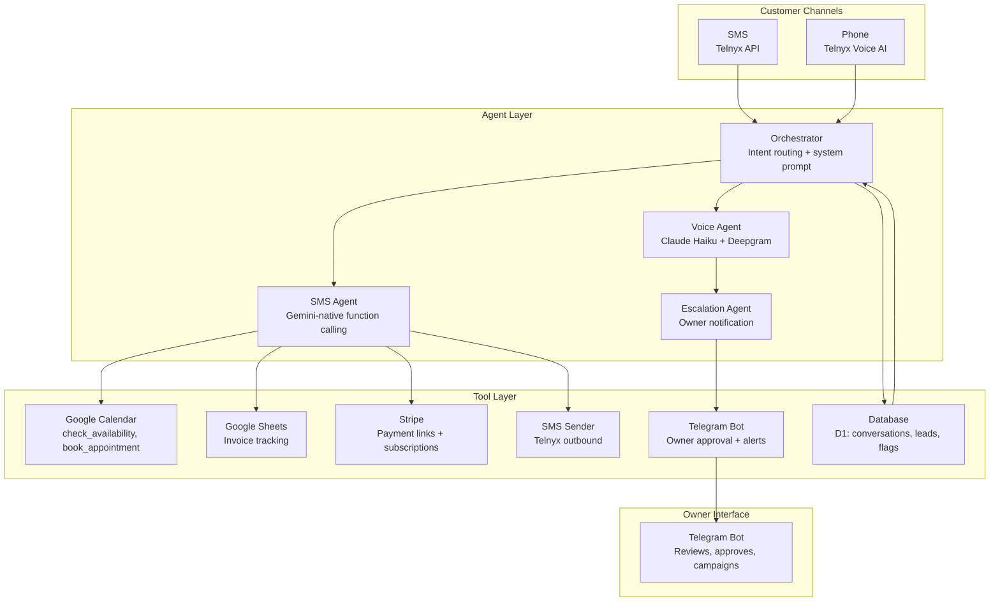

# SMB Forge: Multi-Agent AI Platform for Service Businesses

**Live production system** handling phone calls, SMS, scheduling, invoicing, and payments for home service businesses. Built from 0 to 1 in 2 months.

Live Product: [smbforge.com](https://smbforge.com)
Demo: Call or text **(949) 565-1908** 24/7

---

## Engineering Highlights

- **Multi-agent system architecture**: intent routing with agentic tool calling (agents parse natural language and chain API calls to Google Calendar, Stripe, Telnyx, Telegram via function calling, not hard-coded decision trees)
- **6-provider LLM routing**: evaluated and routed across Claude, GPT, Gemini, Llama, Qwen, and Mistral, selecting per-workflow for capability and cost. Achieved $0.02/call average inference through tiered provider selection.
- **Edge compute infrastructure**: Cloudflare Workers with D1 (SQLite at edge) for state management, KV stores for caching, and CI/CD via wrangler. $0 fixed-cost infrastructure.
- **Full observability**: every agent decision trace and outcome (booked, ordered, transferred, hangup) logged to D1 with Telegram alerts and transcript summaries.
- **LLM-in-the-loop data QC**: agents validate inputs against business rules before execution. Human-in-the-loop approval via Telegram bot with 27 tool declarations.
- **Hybrid retrieval system**: dense semantic matching (LLM-embedded customer intent against skill definitions) overlaid with sparse keyword patterns for deterministic workflow routing.
- **Self-service onboarding pipeline**: Stripe webhook triggers automated SMS, conversational agent collects business data, provisions phone numbers and generates skill files.

---

## System Architecture

### Core Agent Flow

1. Customer contacts via phone call or SMS
2. AI Conversation Agent greets, captures intent, navigates three journeys (booking, ordering, escalation)
3. Reasoning + tool-calling agent processes the request (checks calendar, parses order data, or triggers escalation)
4. Summary sent to owner via Telegram bot with human-in-the-loop approval
5. Approved actions executed (calendar sync, Stripe invoice, SMS confirmation)
6. Autonomous follow-ups (review requests, lead re-engagement, missed call text-back)

---

## Production Scale

| Metric | Value |
|--------|-------|
| Leads processed | 510+ |
| SMS conversations handled | 114+ |
| Voice AI calls | Live on +1 (949) 565-1908 |
| Infrastructure cost | $0/mo (Cloudflare free tier) |
| LLM inference cost | ~$0.02/call |
| Agent response quality | <1% bot unresponsive rate, >80% journey completion |
| Uptime | 99.9%+ across all components |

---

## Tech Stack

| Layer | Technology |
|-------|-----------|
| Runtime | Cloudflare Workers (TypeScript, Hono) |
| Database | Cloudflare D1 (SQLite-compatible) |
| Cache/Config | Cloudflare KV |
| SMS | Telnyx API (10DLC registered) |
| Voice AI | Telnyx Voice AI + Claude Haiku + Deepgram |
| LLM | Gemini 2.5 Flash / Claude (voice) |
| Scheduling | Google Calendar REST API (no SDK) |
| Payments | Stripe REST API (no SDK) |
| Owner UI | Telegram Bot (LLM-native, 27 tool declarations) |
| Deployment | Cloudflare + CI/CD via wrangler |

---

## Open-Source Templates

This repo also contains **3 self-hosted AI agent templates** extracted from the production system:

- **AI Scheduler** — Google Calendar conversational booking agent
- **AI Invoicing** — Stripe conversational invoicing agent
- **AI Ordering** — Product catalog and cart manager

Each template is MIT licensed, uses raw `fetch()` (zero SDK dependencies), and deploys to Cloudflare Workers in 5 minutes.

Explore: [architecture/](architecture/) | [docs/](docs/) | [examples/](examples/) | [products/](products/)

---

## About the Builder

Built by **Michael Lin** — Data Engineer and AI Systems Builder.

- Designed, architected, and deployed the full production system end-to-end in 2 months
- Scoped requirements directly with plumbers, electricians, and cleaners
- Built autonomous multi-agent system from conversational prototype to production
- Iterated through real user feedback across 5+ major architecture revisions

[GitHub](https://github.com/linmichael123) | [smbforge.com](https://smbforge.com)