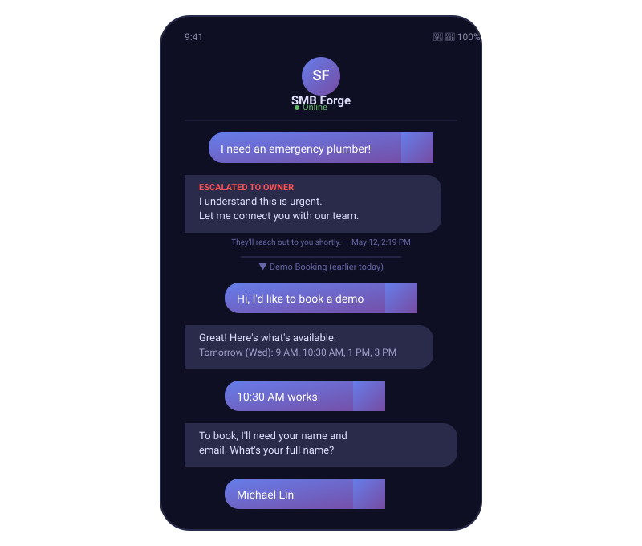
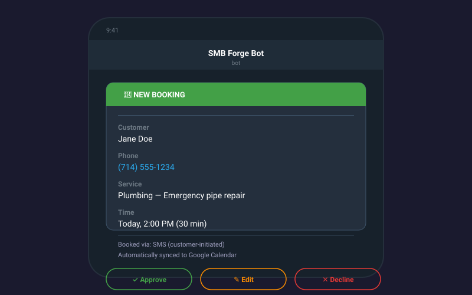
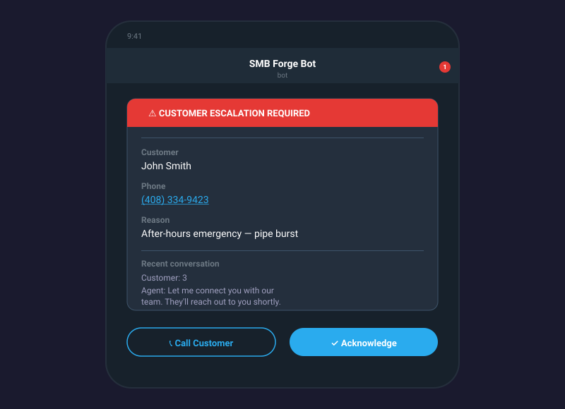
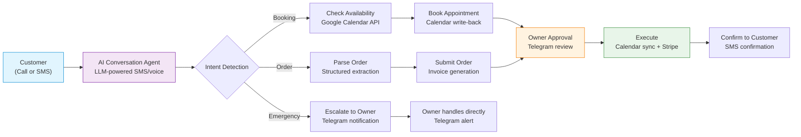
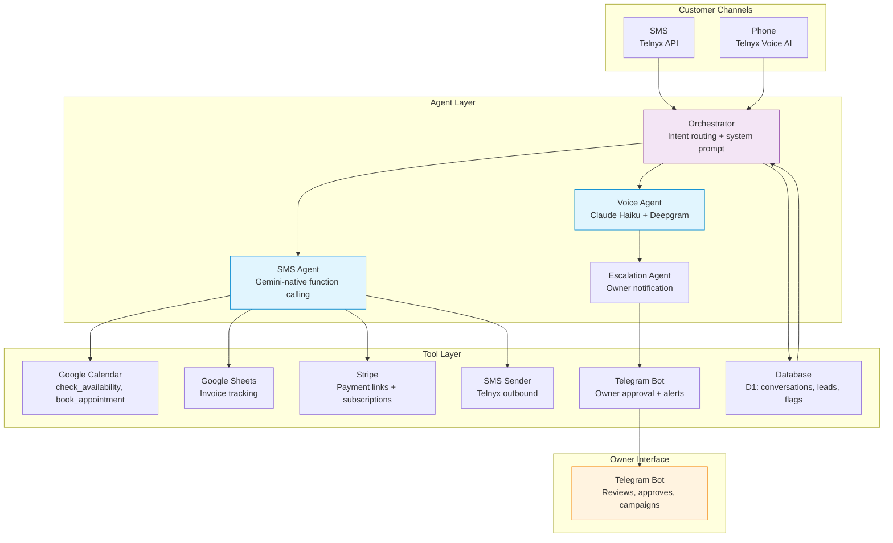

# SMB Forge: Agentic AI Workflows for Service Businesses

**Back Office in a Box** — Production multi-agent AI system that replaces the receptionist, scheduler, and bookkeeper for plumbers, electricians, cleaners, and other service trades.

Every call answered. Every job booked. Every invoice sent.  
No app. No dashboard. Just SMS + Telegram.

Live Product: [https://smbforge.com](https://smbforge.com)  
Demo: Call or text **(949) 565-1908** 24/7 and experience the full autonomous workflow.

---

## Engineering Highlights

A solo-engineered, production-grade multi-agent system — designed, built, and deployed end-to-end with real service-business customers in live operation.

### System Design Decisions

- **Multi-agent architecture with explicit orchestration layer** — a single Orchestrator agent routes intent (booking / ordering / emergency) to specialized SMS, Voice, and Escalation agents, each with its own system prompt and toolset. This separation keeps prompt scope narrow, tool declarations focused, and makes each agent independently testable.
- **Human-in-the-loop via Telegram, not a web dashboard** — the owner approves every booking, invoice, and escalation through a Telegram bot with 27 tool declarations. Zero frontend to build or maintain; the LLM-native bot interface ships new owner actions by adding a tool, not a screen.
- **Channel-as-transport, not channel-as-product** — SMS (Telnyx) and voice (Telnyx Voice AI) are treated as interchangeable transports into the same agent layer. Adding a new channel means writing an adapter, not re-architecting the reasoning pipeline.
- **Edge-first runtime on Cloudflare Workers** — the entire backend runs on serverless edge compute with D1 (SQLite) for durable state and KV for config/cache. No servers to provision, sub-50ms cold starts, and automatic global distribution.
- **Stateful conversations on a stateless runtime** — conversation history, lead state, and escalation flags persist in D1 and are rehydrated per-turn, so the agent layer stays stateless and horizontally scalable.

### Scale & Production Results

- **8,279 leads** in the active pipeline; **5,128** form-eligible
- **130+ SMS conversations** handled autonomously end-to-end
- **< 1% bot-unresponsive rate** and **> 80% journey completion**
- **10DLC carrier-approved** daily cold SMS at 10/day
- **Live voice AI** on **+1 (949) 565-1908**, answering 24/7
- **99.9%+ uptime** across all components

### Tech Choices

| Layer | Technology | Why |
|-------|-----------|-----|
| **Runtime** | Cloudflare Workers (TypeScript, Hono) | Edge-native, $0 baseline cost, no cold-start tuning |
| **Database** | Cloudflare D1 | SQLite-compatible, co-located with Workers, durable conversation state |
| **Cache/Config** | Cloudflare KV | Millisecond reads for feature flags and tenant config |
| **SMS** | Telnyx API | 10DLC registration, reliable delivery, programmatic number provisioning |
| **Voice AI** | Telnyx Voice AI + Claude Haiku + Deepgram | Sub-second TTS/STT; Claude for low-latency reasoning on the call path |
| **LLM (SMS)** | Gemini 2.5 Flash Lite / Flash | Native function calling, high throughput, low cost per turn |
| **Scheduling** | Google Calendar API | Real-time availability + write-back, no custom calendar store |
| **Payments** | Stripe | Payment links + subscriptions, minimal integration surface |
| **Owner UI** | Telegram Bot (LLM-native) | 27 tool declarations; no web frontend to maintain |
| **Deployment** | Cloudflare + macOS LaunchAgents | Workers for the cloud; LaunchAgents for local scheduled jobs |

### Built From Scratch

- **Intent routing + conversation state machine** — the Orchestrator and per-journey prompt scaffolding were authored from the ground up; no off-the-shelf agent framework.
- **Telegram owner bot with 27 tool declarations** — an LM-native command surface (approve/decline/edit bookings, view schedule, broadcast campaigns, manage leads) built directly on the Telegram Bot API.
- **D1 conversation persistence layer** — schema, queries, and per-turn state rehydration written by hand to fit the stateless Workers model.
- **Google Calendar availability engine** — real-time slot computation and write-back against the live Calendar API.
- **Stripe invoicing pipeline** — order-to-invoice flow with Google Sheets as the ledger and Stripe for payment link generation.
- **Escalation agent** — emergency detection + Telegram owner alerting with full conversation context, built from scratch.
- **Cold-SMS lead engine** — 10DLC-compliant outbound pipeline with daily throughput, lead capture, and re-engagement logic.

---

## Screenshots

### SMS Booking + Escalation Flow

*A real SMS conversation: customer books a demo, then an emergency escalation triggers immediate owner notification via Telegram.*

### Telegram Owner Notifications
<div align="center">
  
  
</div>

*Left: New booking notification with approve/edit/decline actions. Right: Escalation alert with customer details and conversation context.*

---

## How It Works (Agentic Architecture)



### Core Agent Flow

1. **Customer contacts** via phone call or SMS text message
2. **AI Conversation Agent** greets, captures intent, and navigates the three journeys (booking, ordering, emergency escalation)
3. **Reasoning + tool-calling agent** processes the request — checks Google Calendar availability, parses structured order data, or triggers escalation
4. **Summary sent to owner** via Telegram bot with human-in-the-loop approval
5. **Approved actions executed** — Google Calendar sync, Stripe invoice generation, SMS confirmation to customer
6. **Autonomous follow-ups** — review requests, lead re-engagement, missed call text-back

---

## Key Features

- **24/7 AI call answering** — never miss a customer, day or night
- **2-way SMS conversations** — customers text naturally, agent responds in their language
- **Telegram Owner Bot** — central command center: approve orders, view schedule, manage campaigns
- **Real-time Google Calendar booking** — slots offered proactively, booked with confirmation
- **Ordering & invoicing** — via Google Sheets + Stripe payment links
- **Intelligent escalation** — complex issues, pricing negotiations, and emergencies route to the owner
- **Multi-language support** — detects and responds in the customer's language
- **Autonomous follow-ups** — lead nurturing, review requests, campaign broadcasts

---

## Multi-Agent Architecture



See the [full architecture docs](architecture/) for detailed flow diagrams and component breakdowns.  
Explore → [architecture/](architecture/) · [docs/](docs/) · [examples/](examples/)

---

## Tech Stack

| Layer | Technology |
|-------|-----------|
| **Runtime** | Cloudflare Workers (TypeScript, Hono) |
| **Database** | Cloudflare D1 (SQLite-compatible) |
| **Cache/Config** | Cloudflare KV |
| **SMS** | Telnyx API (10DLC registered) |
| **Voice AI** | Telnyx Voice AI + Claude Haiku + Deepgram |
| **LLM** | Gemini 2.5 Flash Lite / Flash; Claude (voice) |
| **Scheduling** | Google Calendar API |
| **Payments** | Stripe |
| **Owner UI** | Telegram Bot (LLM-native, 27 tool declarations) |
| **Deployment** | Cloudflare + macOS LaunchAgents |

Explore → [docs/how-it-works.md](docs/how-it-works.md) for architecture deep-dive · [docs/results-metrics.md](docs/results-metrics.md) for production data

---

## Production Results

| System Scale | Value |
|-------------|-------|
| Leads in pipeline | **8,279** |
| Conversations handled | **130+** SMS conversations |
| Voice AI calls | Live on **+1 (949) 565-1908** |
| Daily cold SMS | 10/day (10DLC carrier-approved) |
| Form-eligible leads | 5,128 |

**Agent Performance:** < 1% bot unresponsive rate · > 80% journey completion · All critical escalations flagged correctly.

**Infrastructure:** Cloudflare Workers + D1 + KV at $0/mo baseline. Total monthly infra ~$60 (variable with usage). 99.9%+ uptime across all components.

**Operational Impact:**
- Emergency calls at 2 AM → no more voicemail black hole — AI answers and escalates instantly.
- Simultaneous inbound handling — AI manages multiple conversations at once while the owner works.
- Auto-generated invoices replace 5+ hours/week of manual admin.

Explore the [detailed production metrics](docs/results-metrics.md) for full tables and operational data.

---

## Repository Structure

```
smbforge-agentic-workflows/
├── README.md                  ← This file
├── SETUP.md                   ← Build & deploy story (4 weeks, solo)
├── LICENSE                    ← MIT
├── architecture/
│   ├── workflow-diagram.md    ← End-to-end customer flow (Mermaid)
│   ├── agent-architecture.md  ← Multi-agent system breakdown (Mermaid)
│   └── data-flow.md           ← Data persistence and state management
├── examples/
│   ├── booking-agent-prompt-template.md
│   ├── tool-calling-example.py
│   └── telegram-escalation-logic.md
├── docs/
│   ├── how-it-works.md        ← Detailed system narrative
│   ├── booking-workflow.md    ← Booking journey end-to-end
│   ├── invoicing-workflow.md  ← Order-to-invoice pipeline
│   └── results-metrics.md     ← Real production metrics
└── media/
    ├── README.md              ← Screenshot instructions
    └── telegram-mockup-description.md
```

---

## About the Builder

Built by Michael Lin — Forward Deployed Engineer.  
Designed, architected, and deployed end-to-end in live production with real service business customers.

- Scoped requirements directly with plumbers, electricians, and cleaners
- Built autonomous multi-agent system from conversational prototype to production
- Delivered measurable ROI (customer time savings, lead capture rates)
- Iterated through real user feedback across 5+ major architecture revisions

---

**[smbforge.com](https://smbforge.com)** · **Text/Call (949) 565-1908** · **michael@smbforge.com**