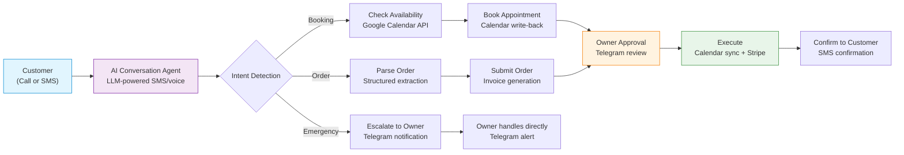
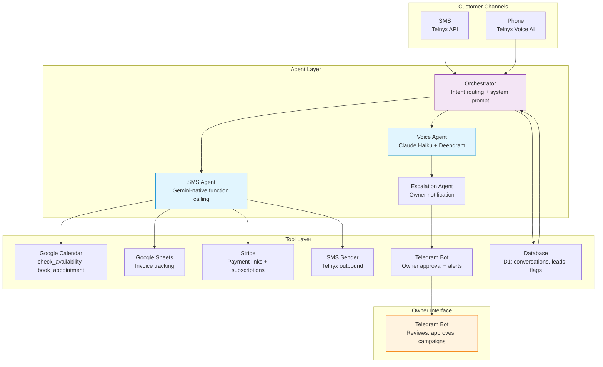

# SMB Forge: Agentic AI Workflows for Service Businesses

**Back Office in a Box** — Production multi-agent AI system that replaces the receptionist, scheduler, and bookkeeper for plumbers, electricians, cleaners, and other service trades.

Every call answered. Every job booked. Every invoice sent.  
No app. No dashboard. Just SMS + Telegram.

Live Product: [https://smbforge.com](https://smbforge.com)  
Demo: Call or text **(949) 565-1908** 24/7 and experience the full autonomous workflow.

---

## The Problem

Service business owners lose **5+ hours/week** on phone tag, scheduling, and invoicing. A traditional receptionist costs **$3,100/mo**. Voicemail is a black hole — most callers don't leave messages.

SMB Forge delivers the entire back office for **$49–$199/mo**.

---

## How It Works (Agentic Architecture)



### Core Agent Flow

1. **Customer contacts** via phone call or SMS text message
2. **AI Conversation Agent** greets, captures intent, and navigates the three journeys (booking, ordering, emergency escalation)
3. **Reasoning + tool-calling agent** processes the request — checks Google Calendar availability, parses structured order data, or triggers escalation
4. **Summary sent to owner** via Telegram bot with human-in-the-loop approval
5. **Approved actions executed** — Google Calendar sync, Stripe invoice generation, SMS confirmation to customer
6. **Autonomous follow-ups** — review requests, lead re-engagement, missed call text-back (on higher plans)

---

## Key Features

- **24/7 AI call answering** — never miss a customer, day or night
- **2-way SMS conversations** — customers text naturally, agent responds in their language
- **Telegram Owner Bot** — central command center: approve orders, view schedule, manage campaigns
- **Real-time Google Calendar booking** — slots offered proactively, booked with confirmation
- **Ordering & invoicing** — via Google Sheets + Stripe payment links
- **Intelligent escalation** — complex issues, pricing negotiations, and emergencies route to the owner
- **Multi-language support** — detects and responds in the customer's language
- **Autonomous follow-ups** — lead nurturing, review requests, campaign broadcasts (Max plan)

---

## Pricing Plans

| Tier | Price | What's Included |
|------|-------|-----------------|
| **Starter** | **$49/mo** (+$99 setup) | AI scheduling, Google Calendar sync, reminders, Telegram alerts, review requests, basic website |
| **Pro** | **$99/mo** (+$199 setup) | Everything in Starter + AI ordering, AI invoicing, PDF invoices, Google Sheets tracker |
| **Max** | **$199/mo** (+$299 setup) | Everything in Pro + AI voice assistant, lead follow-up, review management, missed call text-back, campaign texting |
| **Concierge** | **Custom** | Bespoke workflows, dedicated support, custom integrations |

First month free with code **FIRSTMONTHFREE** (limited — 50 spots).  
[Try it now](https://smbforge.com) — or text/call **(949) 565-1908**.

---

## Multi-Agent Architecture



See the [full architecture docs](architecture/) for detailed flow diagrams and component breakdowns.

---

## Tech Stack

| Layer | Technology |
|-------|-----------|
| **Runtime** | Cloudflare Workers (TypeScript, Hono) |
| **Database** | Cloudflare D1 (SQLite-compatible) |
| **Cache/Config** | Cloudflare KV |
| **SMS** | Telnyx API (10DLC registered) |
| **Voice AI** | Telnyx Voice AI + Claude Haiku + Deepgram | 
| **LLM** | Gemini 2.5 Flash Lite / Flash; Claude (voice) |
| **Scheduling** | Google Calendar API |
| **Payments** | Stripe |
| **Owner UI** | Telegram Bot (LLM-native, 27 tool declarations) |
| **Deployment** | Cloudflare + macOS LaunchAgents |

---

## Production Results

- **Saves customers 5+ hours/week** of admin work — phone tag, scheduling, invoicing
- **Pays for itself** after saving just 2 hours/month
- **24/7 uptime** — Cloudflare Workers edge deployment
- **Data stays in customer's Google accounts** — they retain full ownership
- **10DLC compliant** — carrier-approved business SMS (not spam-filtered)

---

## What Makes This Different

| Approach | Cost | Coverage | Setup |
|----------|------|----------|-------|
| Traditional receptionist | $3,100/mo | Business hours only | 2+ weeks hiring |
| Answering service | $235/mo | Phone only, messages only | Days |
| **SMB Forge** | **$49–$199/mo** | **24/7 SMS + voice + operations** | **24 hours** |

---

## Repository Structure

```
smbforge-agentic-workflows/
├── README.md                  ← This file
├── LICENSE                    ← MIT
├── architecture/
│   ├── workflow-diagram.md    ← End-to-end customer flow (Mermaid)
│   ├── agent-architecture.md  ← Multi-agent system breakdown (Mermaid)
│   └── data-flow.md           ← Data persistence and state management
├── examples/
│   ├── booking-agent-prompt-template.md
│   ├── tool-calling-example.py
│   └── telegram-escalation-logic.md
├── docs/
│   ├── how-it-works.md        ← Detailed system narrative
│   ├── booking-workflow.md    ← Booking journey end-to-end
│   ├── invoicing-workflow.md  ← Order-to-invoice pipeline
│   └── results-metrics.md     ← Real production metrics
└── media/
    ├── README.md              ← Screenshot instructions
    └── telegram-mockup-description.md
```

---

## About the Builder

Built by Michael Lin — Forward Deployed Engineer.  
Designed, architected, and deployed end-to-end in live production with real service business customers.

- Scoped requirements directly with plumbers, electricians, and cleaners
- Built autonomous multi-agent system from conversational prototype to production
- Delivered measurable ROI (customer time savings, lead capture rates)
- Iterated through real user feedback across 5+ major architecture revisions

---

**[smbforge.com](https://smbforge.com)** · **Text/Call (949) 565-1908** · **michael@smbforge.com**
