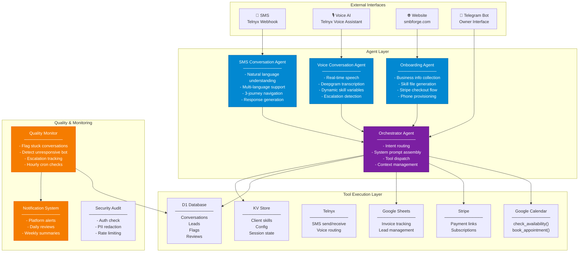

# Multi-Agent Architecture

Breakdown of the autonomous agent system, agent roles, and how they collaborate.



## Agent Responsibilities

### Orchestrator Agent
The central routing layer. It doesn't generate customer-facing responses — it routes intent to the right sub-agent and dispatches tools. Built with a system prompt that includes client configuration, escalation rules, and capability definitions.

**Key behaviors:**
- Assembles context from KV (client skill, config flags, pending items)
- Routes between SMS, voice, and onboarding sub-agents
- Manages CONVERSATION_LIMITS (nudge at 8 turns, direct at 12)
- Handles journey switching cleanly (abandons previous journey)

### SMS Conversation Agent
The customer-facing text agent. Handles the full 3-journey model with Gemini native function calling.

**Journeys:**
| Journey | Trigger | Flow |
|---------|---------|------|
| **Booking** | "Book a demo" / "I need a quote" | Check availability → present slots → collect name/email → book → confirm |
| **Ordering** | "Sign me up" / "Pricing" | Present plans → recommend → parse order → collect info → submit |
| **Escalation** | "Emergency" / "I want to cancel" | Escalate immediately → Telegram notification → owner handles |

### Voice Conversation Agent
Handles inbound phone calls via Telnyx Voice AI. Uses Claude Haiku for conversation + Deepgram for transcription + natural-sounding TTS.

**Configuration:**
- Dynamic skill variables loaded per client
- Escalation triggers parsed from client skill files
- Noise suppression (Krisp)
- Speed: 0.93x for natural pacing

### Quality Monitor
Runs on an hourly cron to detect and flag issues:

| Flag Type | Detects | Action |
|-----------|---------|--------|
| `bot_unresponsive` | Bot didn't reply to customer in 15+ min | Critical alert to platform |
| `stuck` | Conversation idle 24h with no resolution | Auto-resolved, warning flag |
| `escalation_unresolved` | Escalation pending 2+ hours | Recurring warning (deduplicated) |
| `safety_gate` | Outreach sending at 0% reply rate | Auto-pause pipeline |

## Conversation Lifecycle

```
NEW → [Greeting + Menu] → ACTIVE → [Journey in progress]
                                      ↓
                              RESOLVED (successful booking/order)
                                      ↓
                              ESCALATED (sent to owner via Telegram)
                                      ↓
                              RESOLVED (owner handled it)
                                      ↓
                              AUTO-RESOLVED (24h idle)
```

Each transition is logged to D1 with full message history for audit and analysis.
