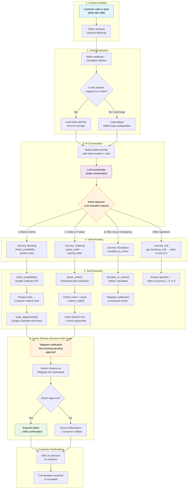

# Customer Workflow Diagram

Full end-to-end flow of a customer interaction with SMB Forge's autonomous agent system.

## Key Design Decisions

### Why SMS-First? 
Service business owners are on job sites — they can't stare at a dashboard. SMS is the only channel that works in a crawlspace, on a roof, or with wet hands. Telegram provides the owner interface when they take a break.

### Why LLM-Native Routing?
Traditional IVR trees ("Press 1 for...") have <20% completion rates for trades. An LLM that understands "My pipe burst" vs "How much for a water heater?" routes naturally without forcing customers through menus.

### Why Human-in-the-Loop?
Autonomy is the goal, but the owner knows their business. Escalation triggers (pricing negotiations, complaints, complex requests) route to Telegram where the owner makes the final call. This builds trust and catches edge cases the AI misses.
