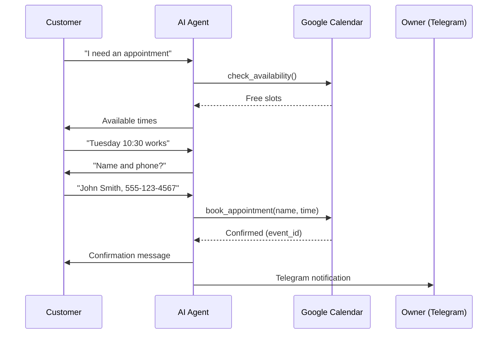

# Booking Workflow

End-to-end breakdown of how a customer books an appointment through the autonomous agent.

## The Booking Journey

### Step 1: Customer Reaches Out

The customer sends an SMS to the business's number:

```
Customer: "I need an appointment for an AC repair"
```

The webhook fires, client is resolved, skill file loaded, and the SMS Conversation Agent begins.

### Step 2: Intent Detection

The LLM classifies the message as a **booking intent**. Three possible journeys:

| Intent | Keywords | Action |
|--------|----------|--------|
| Booking | "Book", "appointment", "schedule", "quote" | Start booking flow |
| Ordering | "Sign up", "price", "plan", "order" | Start ordering flow |
| Emergency | "Emergency", "urgent", "pipe burst" | Escalate immediately |

### Step 3: Availability Check

The agent calls `check_availability()` — a tool that queries Google Calendar for free slots:

```
Agent calls: check_availability(duration=30)
Calendar API returns: [
  "Tue May 14: 9:00, 10:30, 1:00, 3:00",
  "Wed May 15: 9:00, 11:00, 2:00",
  "Thu May 16: 10:00, 1:30, 4:00"
]
```

The agent formats this into a natural SMS:

```
Agent: "Here's what's available:
Tomorrow (Tue May 14):
• 9:00 AM
• 10:30 AM
• 1:00 PM
• 3:00 PM

Wednesday:
• 9:00 AM
• 11:00 AM
• 2:00 PM

Which works best?"
```

**Critical design choice:** The agent shows slots BEFORE asking "when works for you?" This reduces back-and-forth from 4+ messages to 2.

### Step 4: Customer Selects Time

```
Customer: "Tuesday at 10:30 works"
```

The agent confirms availability and collects contact info:

```
Agent: "Great, Tuesday at 10:30 AM. To confirm, I'll need your name and phone number."
```

### Step 5: Booking Execution

```
Customer: "John Smith, 555-123-4567"
Agent calls: book_appointment(name="John Smith", phone="555-123-4567", time="Tue May 14 10:30")
Calendar API returns: { event_id: "evt_abc123", status: "confirmed" }
```

Calendar event is created with:
- Title: "Appointment — John Smith"
- Time: Tue May 14, 10:30-11:00 AM PT
- Description: Customer phone + booking source (SMS)
- Reminder: 24h and 1h before

### Step 6: Confirmation

```
Agent: "You're all set! ✅
Appointment: Tuesday, May 14 at 10:30 AM
With: [Business Name]
Address: [Business Address]

We'll send you a reminder closer to the date. Reply STOP to opt out."
```

### Step 7: Owner Notification

The Telegram bot sends to the owner:

```
📅 New Booking
Customer: John Smith (555-123-4567)
Time: Tue May 14, 10:30 AM
Source: SMS booking

[Approve] [Reschedule] [Cancel]
```

### Step 8: Follow-up (Automatic)

- **24h before**: Automatic SMS reminder sent
- **After appointment**: Review request sent (auto or manual, based on plan)
- **No-show**: Follow-up SMS and lead re-engagement (Max plan)

## Booking Flow Diagram



## Error States

| Situation | Agent Behavior |
|-----------|---------------|
| No slots available | "The earliest available is [date]. Shall I book that?" |
| Customer wants different day | Re-check availability for that date |
| Calendar API down | "I'm having trouble checking the calendar. Let me connect you with our team." → escalate |
| Customer cancels mid-flow | Cancel → log as `lost` lead → "No problem. Let me know if you need anything else!" |
