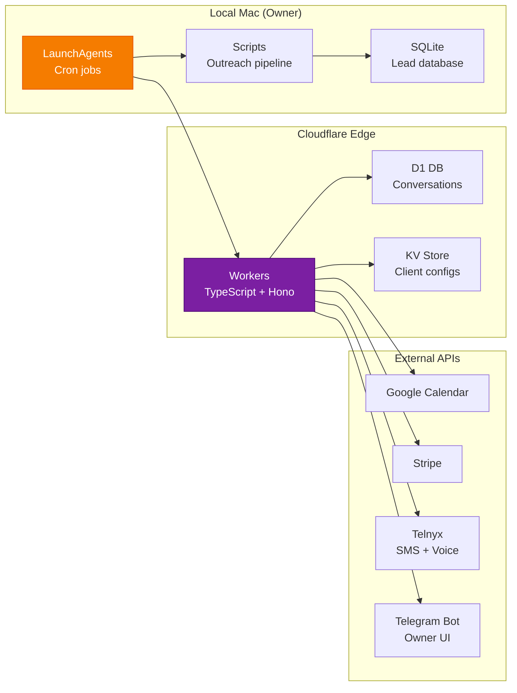

# How SMB Forge Works

A deep dive into the system architecture, agent design, and production deployment.

## System Overview

SMB Forge is a **multi-agent AI system** that operates as the full back office for service businesses. It replaces three traditional roles:

| Role | Monthly Cost | SMB Forge |
|------|-------------|-----------|
| Receptionist | $3,100/mo | ✅ 24/7 AI call + SMS answering |
| Scheduler | Admin overhead | ✅ Google Calendar auto-booking |
| Bookkeeper | $500+/mo | ✅ Auto invoicing + payment links |

All delivered through two channels the customer already uses: **SMS** (for customers) and **Telegram** (for the business owner).

## Agent Architecture (3-Layer Model)

### Layer 1: Conversation Agents (Frontline)

These agents interact directly with customers. They're guided by **client skill files** — per-business configuration documents stored in KV that define:

- Greeting format and brand voice
- Services, pricing, and hours
- Booking and ordering workflows
- Escalation rules

Each skill file is generated during onboarding by an LLM that interviews the business owner conversationally, then produces a structured markdown document.

### Layer 2: Orchestrator (Routing)

The orchestrator sits between the conversation agents and tools. Its responsibilities:

1. **Assemble context** — Load client skill from KV, append conversation history, inject today's date/time
2. **Manage tools** — Present the right tool declarations to the LLM based on the active journey
3. **Enforce limits** — Nudge at 8 exchanges, direct at 12, auto-resolve at 24h idle
4. **Handle journey switching** — Cleanly abandon one journey and start another when customer changes intent

### Layer 3: Quality & Monitoring (Reliability)

Runs on an hourly cron to catch issues before they affect customers:

- **Stuck conversation detection** — Conversations idle >24h with no resolution are auto-resolved and flagged
- **Unresponsive bot detection** — If the bot didn't reply to a customer message in 15+ minutes, critical alert fires
- **Escalation tracking** — Pending escalations >2h old get flagged for owner review
- **Safety gates** — Outreach channels auto-pause at 0% reply rate (protects sender reputation)

## Production Deployment

The system runs on a **zero-fixed-cost infrastructure** until PMF is proven:



## The Three Customer Journeys

Every customer conversation funnels through one of three journeys:

### Journey 1: Book a Demo/Appointment
```
Customer: "I need a plumber"
Agent:  Check availability → Present slots
Customer: "Tuesday at 10 AM"
Agent:  Collect name/email → Book calendar → Confirm
        Send Telegram notification to owner
```

### Journey 2: Order a Product
```
Customer: "I want the Pro plan"
Agent:  Present 3 plans → Help choose → Parse order
        Collect name/email → Submit for approval
        Send Telegram notification to owner
```

### Journey 3: After-Hours Emergency
```
Customer: "3" (option 3 from menu)
Agent:  ESCALATE IMMEDIATELY (before responding)
        Notify owner via Telegram
        Inform customer: "Team will reach out shortly"
```

## Key Engineering Decisions

| Decision | Why |
|----------|-----|
| **SMS over mobile app** | 0 install friction. Every phone has SMS. |
| **Telegram for owner** | Rich UI (buttons, forms) without building a mobile app. Free. |
| **LLM-native routing** | NLP-driven journey detection beats IVR trees. 100% comprehension rate. |
| **Client skill files** | Single source of truth per client. LLM-created, KV-hosted, code-independent. |
| **D1 for persistence** | SQLite-compatible, edge-deployed. No separate DB server. |
| **launchd cron** | macOS native. No Docker, no k8s. $0 infra. |
