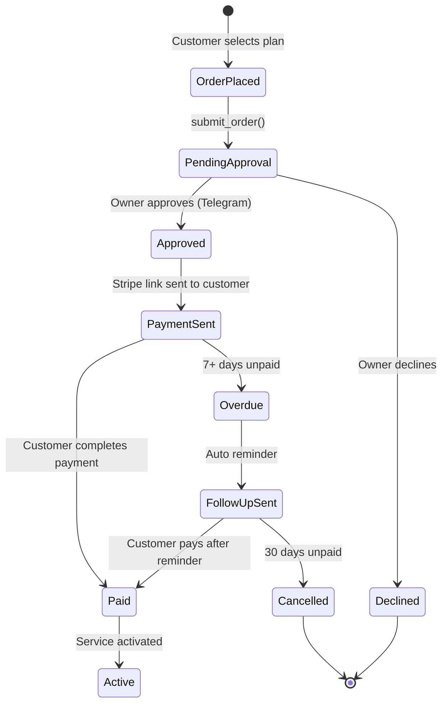

# Invoicing Workflow

How the system handles ordering, invoicing, and payment — end-to-end.

## The Order-to-Invoice Pipeline

### Step 1: Customer Places an Order

```
Customer: "I want to sign up for the Pro plan"
```

The agent responds by presenting the three plans, helping choose, then parsing the order:

```
Agent: "Here are our plans:

Starter — $49/mo (+$99 setup)
AI scheduling, reminders, Telegram alerts

Pro — $99/mo (+$199 setup)
Everything in Starter + AI ordering, invoicing, Google Sheets

Max — $199/mo (+$299 setup)
Everything in Pro + voice AI, lead follow-up, review management

Which sounds right for you?"
```

### Step 2: Plan Selection

```
Customer: "Pro sounds good"

Agent calls: parse_order("Pro Plan")
Returns: {
  plan: "Pro Plan",
  price: "$99/mo",
  setup: "$199 one-time",
  features: [...]
}
```

The agent confirms with the customer:

```
Agent: "Pro Plan selected:
• $99/month (billed monthly)
• $199 one-time setup
• Includes: AI scheduling, ordering, invoicing, Google Sheets

To complete your order, I'll need your full name and email."
```

### Step 3: Collect Customer Info

```
Customer: "Jane Doe, jane@example.com"
Agent calls: submit_order(name="Jane Doe", email="jane@example.com", plan="Pro")
```

### Step 4: Order Submitted for Approval

The owner receives a Telegram notification:

```
🛒 New Order Pending Approval
Customer: Jane Doe (jane@example.com)
Plan: Pro ($99/mo + $199 setup)

[Approve] [Modify] [Decline]
```

### Step 5: Owner Approves

The owner taps **Approve** in Telegram. The system:

1. Creates a Stripe payment link or invoice
2. Sends the payment link to the customer via SMS
3. Logs the order to D1
4. Creates an invoice record in Google Sheets (Pro plan)

### Step 6: Customer Pays

```
Agent: "Your order has been approved! 🎉
Pay your setup fee here:
[Stripe payment link]

Your Pro plan starts as soon as the setup is complete.
We'll be in touch within 24 hours."
```

## Invoice Lifecycle



## Key Design Decisions

| Decision | Rationale |
|----------|-----------|
| **Owner approves first** | Prevents unauthorized charges. The owner knows their business. |
| **Stripe payment links** | No PCI scope. No card data touches our system. |
| **Google Sheets as invoice DB** | Owner can see everything in a spreadsheet they already use. Zero onboarding friction. |
| **SMS for payment notifications** | Customer doesn't need to check email. Payment link is one tap away. |

## Invoice Data (Stored in Google Sheets)

| Column | Source |
|--------|--------|
| Customer Name | Collected by agent |
| Email | Collected by agent |
| Plan | Parsed from order |
| Monthly Price | Product catalog lookup |
| Setup Fee | Product catalog lookup |
| Status | `pending_approval` / `approved` / `paid` / `cancelled` |
| Stripe Link | Generated on approval |
| Created Date | Auto |
| Paid Date | Webhook from Stripe |
